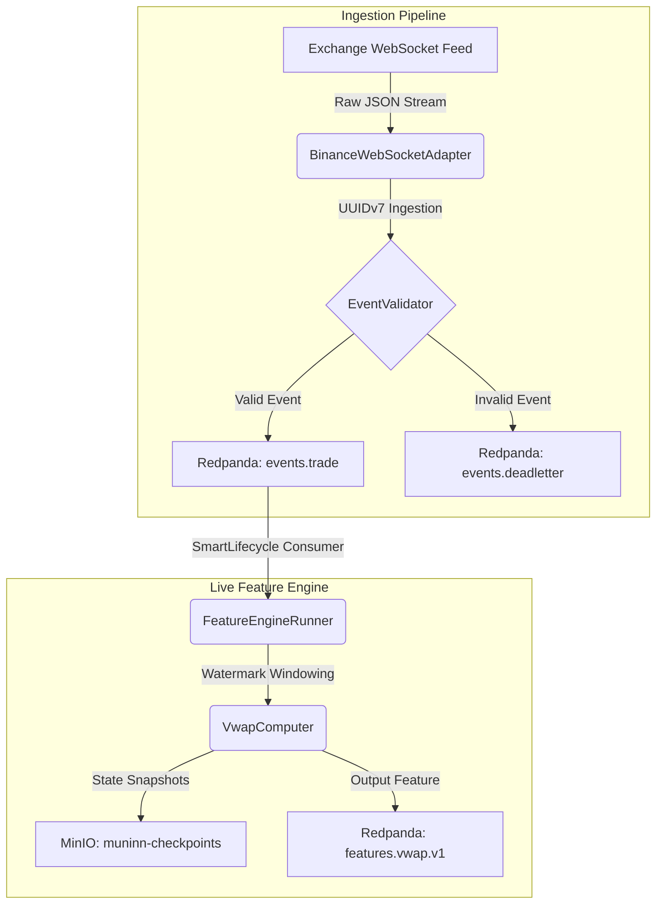
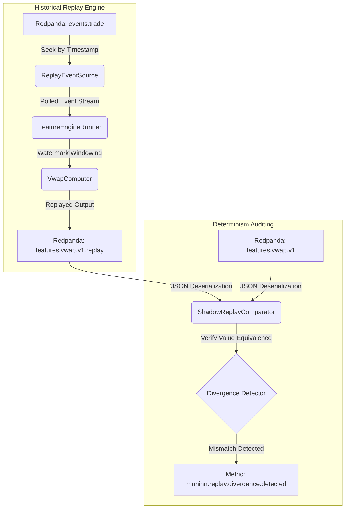
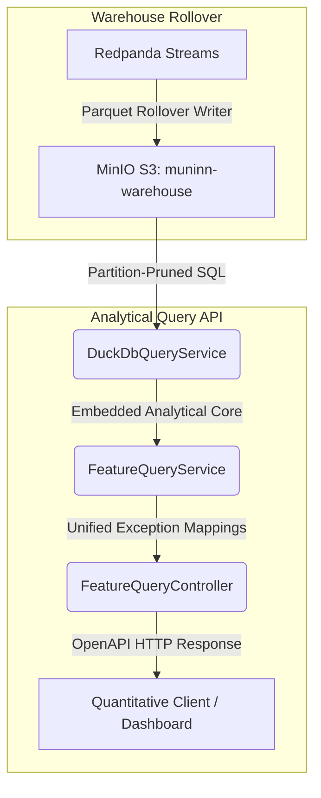

# Muninn

[](https://github.com/lgreene03/muninn/actions/workflows/ci.yml)
[](LICENSE)

**Event-native research infrastructure for deterministic replay, reproducible streaming analytics, and market-data feature computation.**

> *Muninn* — Old Norse for "memory." One of Odin's two ravens. The other is [*Huginn*](https://github.com/lgreene03/huginn) (thought) — the strategy execution engine that consumes Muninn's features.

## What this is — in 30 seconds

Muninn computes streaming analytics features (rolling VWAP, order-book aggregates, custom signals) over an immutable event log. The interesting claim — and the only reason this project exists — is that **any value the system emits live can be reproduced byte-for-byte by replaying the same events later**, against the same code. There aren't two pipelines; there's one feature engine that doesn't know whether it's reading from a live broker or from history.

The property is enforced, not aspired to. Build-time ArchUnit rules forbid the patterns that would break it. A CI integration test produces a known input, runs the engine live, replays it, and asserts byte-identical outputs. The green badge above is enforcing that test continuously.

If you have ten minutes, [DEMO.md](docs/DEMO.md) walks you through booting the stack, sending trades, running a replay, and watching the divergence counter sit at zero. If you have thirty, the [READING_GUIDE](docs/steering/READING_GUIDE.md) maps the documentation to whatever role you're reading from.

If you have one minute: the technical post [What deterministic replay actually means](docs/blog/2026-05-18-deterministic-replay.md) explains the property and how it's enforced.

---

## The Problem

Quantitative research and streaming analytics suffer from a chronic correctness gap: **the system that develops a feature is rarely the system that runs it in production.** Research notebooks run on cleaned CSVs; production runs on a live stream; the two diverge silently. Backtests pass, deployments fail, and nobody can reproduce what happened yesterday.

Muninn closes that gap by making **one immutable event log the source of truth** and **one computation path serve both live and historical workloads.** The same feature engine that emits a value as events arrive emits an identical value when replaying yesterday's events — bit-for-bit.

If your system can't be replayed, it can't be debugged, audited, or improved with confidence. Muninn treats replay as an architectural invariant, not a feature.

---

## Architecture Overview

Muninn is built on a highly clean, decoupled event-driven model. The live and historical replay loops share the exact same deterministic computation paths:

### Live Event Processing Path


### Historical Determinism Replay Path


### Query and Analytical Path


All metadata (such as feature metadata, instrument reference lists, and replay job execution states) is securely transactioned in **PostgreSQL**.

For complete details on determinism guarantees and replay constraints, see [docs/steering/DETERMINISTIC_REPLAY.md](docs/steering/DETERMINISTIC_REPLAY.md).

---

## Local-First Promise

The full system runs on a single **Mac mini M4 with 24 GB RAM** under Docker Compose. No managed cloud services. No credit card. No Kubernetes. The MVP boots in under 5 minutes from cold start.

Four deployment profiles share one codebase:

| Profile               | Target                                        |
|-----------------------|-----------------------------------------------|
| `local-lite`          | Laptop / CI — minimum viable pipeline         |
| `local-full`          | Mac mini M4 — full stack with observability   |
| `cloud-cheap`         | Single VPS — free-tier deployable             |
| `production-reference`| Cloud-scale topology (Phase 8 — documented)   |

See [LOCAL_FIRST_CONSTRAINTS.md](docs/steering/LOCAL_FIRST_CONSTRAINTS.md).

---

## MVP Scope

- **One exchange adapter** (Binance public WebSocket — trades and order book snapshots).
- **One instrument** (`BTC-USDT` via Binance, normalized to canonical naming).
- **Canonical events**: `TradeEvent`, `CandleEvent`, `OrderBookSnapshotEvent`, `FeatureComputedEvent`.
- **Deterministic feature engine** with checkpoints and watermark-based windowing.
- **Replay engine** that reproduces live outputs byte-for-byte from the event log.
- **Read-only query API** over DuckDB + Parquet.
- **Observability stack**: Prometheus + Grafana + Tempo, with named application metrics.

See [ROADMAP.md](docs/steering/ROADMAP.md) for the phased delivery plan.

---

## Quickstart

```bash
git clone https://github.com/your-org/muninn.git
cd muninn

# Start complete infrastructure (PostgreSQL, Redpanda, MinIO + Prometheus, Grafana, Tempo)
docker compose -f docker-compose.yml -f docker-compose.observability.yml up -d

# Create Redpanda topics
./scripts/create-topics.sh

# Build and run
mvn clean package -DskipTests
java -jar target/muninn-0.1.0-SNAPSHOT.jar

# In another terminal — run the E2E verification smoke test
./scripts/smoke.sh

# Enable live Binance WebSocket ingestion (optional)
java -Dmuninn.ingestion.binance.enabled=true -jar target/muninn-0.1.0-SNAPSHOT.jar
```

### Useful endpoints

| URL | Description |
|-----|-------------|
| `http://localhost:8080/actuator/health` | Application health status |
| `http://localhost:8080/actuator/prometheus` | Raw application metrics endpoint |
| `http://localhost:8080/swagger-ui.html` | Swagger UI (Query & Replay endpoints) |
| `http://localhost:8088` | Redpanda Console (topic inspection) |
| `http://localhost:9003` | MinIO Console (S3 storage - minioadmin/minioadmin) |
| `http://localhost:9091` | Prometheus local dashboard (metric aggregations) |
| `http://localhost:3001` | Grafana metrics visualization dashboards |
| `http://localhost:3200` | Grafana Tempo distributed trace browser |

### Running tests

```bash
# Unit + contract tests (fast, no Docker needed)
mvn test

# Integration tests (requires Docker)
mvn test -Dgroups=integration
```

A new contributor or AI agent should be able to read `AGENTS.md`, run the commands above, and see a green smoke test.

---

## Roadmap

- **Phase 0** — Steering docs and repo skeleton ✅
- **Phase 1** — Local ingestion + canonical events ✅
- **Phase 2** — _(merged into Phase 1)_ ✅
- **Phase 3** — Feature engine ✅
- **Phase 4** — Replay engine ✅
- **Phase 5** — Query API ✅
- **Phase 6** — Observability ✅
- **Phase 7** — Docs and demo polish 🚀
- **Phase 8** — Production-reference architecture

Detail in [ROADMAP.md](docs/steering/ROADMAP.md).

---

## Non-Goals

Muninn is **not**:

- A trading bot, an HFT engine, or an autonomous execution system.
- A source of financial advice or trading signals as a product feature.
- A crypto project (crypto APIs are the initial free data source — that is all).
- A production trading system.
- A Kubernetes-native or cloud-native MVP.
- Multi-exchange or multi-tenant in MVP.

Full statement: [NON_GOALS.md](docs/steering/NON_GOALS.md).

---

## Repo Status

**Phase 6 complete.** The entire local-first architecture is fully operational:
*   **Ingestion Pipeline**: Live Binance WS connector, dynamic Event Validator, dead-letter logic, and persistent trade events.
*   **Deterministic Feature Engine**: Rolling watermark windowing, state caching, and JSON/Parquet checkpoint serialization to S3.
*   **Replay Engine**: Multi-mode seekers tracking live vs. shadow comparator execution paths, measuring `muninn.replay.divergence.detected` rates.
*   **Query API**: High-efficiency analytical queries driven by partition-pruned DuckDB over S3 Parquet tables.
*   **Observability Stack**: Unified Prometheus, Grafana, and Tempo telemetry dashboards running in local Docker overlays.

Contributions follow the workflow in [AGENTS.md](AGENTS.md) and [AI_AGENT_WORKFLOW.md](docs/steering/AI_AGENT_WORKFLOW.md).

---

## Steering Documents

| Document | Purpose |
|----------|---------|
| [AGENTS.md](AGENTS.md) | Contract for AI agents and contributors |
| [PROJECT_CONTEXT.md](docs/steering/PROJECT_CONTEXT.md) | What Muninn is and why |
| [ARCHITECTURE_PRINCIPLES.md](docs/steering/ARCHITECTURE_PRINCIPLES.md) | Load-bearing principles |
| [LOCAL_FIRST_CONSTRAINTS.md](docs/steering/LOCAL_FIRST_CONSTRAINTS.md) | Hard constraints for local development |
| [DOMAIN_MODEL.md](docs/steering/DOMAIN_MODEL.md) | Core domain vocabulary |
| [EVENT_SCHEMA_STRATEGY.md](docs/steering/EVENT_SCHEMA_STRATEGY.md) | JSON now, Avro path |
| [DETERMINISTIC_REPLAY.md](docs/steering/DETERMINISTIC_REPLAY.md) | The most important doc |
| [SERVICE_BOUNDARIES.md](docs/steering/SERVICE_BOUNDARIES.md) | Module map |
| [TECH_STACK.md](docs/steering/TECH_STACK.md) | Every dependency, justified |
| [TESTING_STRATEGY.md](docs/steering/TESTING_STRATEGY.md) | Seven test layers |
| [OBSERVABILITY_STRATEGY.md](docs/steering/OBSERVABILITY_STRATEGY.md) | Logs, metrics, traces |
| [DATA_STORAGE_STRATEGY.md](docs/steering/DATA_STORAGE_STRATEGY.md) | Where data lives, and why |
| [ROADMAP.md](docs/steering/ROADMAP.md) | Phased plan |
| [AI_AGENT_WORKFLOW.md](docs/steering/AI_AGENT_WORKFLOW.md) | The agent loop |
| [CODING_STANDARDS.md](docs/steering/CODING_STANDARDS.md) | What to type |
| [NON_GOALS.md](docs/steering/NON_GOALS.md) | What we won't build |

---

## License

[Apache License 2.0](LICENSE). See [NOTICE](NOTICE) for attribution.

## Companion SDKs

- **[muninn-py](https://github.com/lgreene03/muninn-py)** — Python research SDK. Pulls features from this server's `query-api` into Polars / Pandas DataFrames for notebook-driven alpha research. Zero-configuration: `pip install muninn-py` and `MuninnClient()` defaults to `http://localhost:8080`.

## Companion Services

- **[Huginn](https://github.com/lgreene03/huginn)** — Quantitative strategy execution engine. Consumes features from Muninn's Redpanda topics and executes paper-trading strategies (OBI, VPIN, EMA Crossover, VWAP Deviation). Supports multi-strategy backtesting, HTML report generation, and live trading via Sleipnir.
- **[Sleipnir](https://github.com/lgreene03/sleipnir)** — Order execution gateway. Bridges Huginn's order intents to Binance via a production-grade Kafka consumer → risk check → rate-limiter → REST submit → WebSocket fill pipeline.

## Read more

- [docs/DEMO.md](docs/DEMO.md) — 10-minute runnable walkthrough.
- [docs/blog/2026-05-18-deterministic-replay.md](docs/blog/2026-05-18-deterministic-replay.md) — long-form on the central technical claim and how it's enforced.
- [docs/talks/2026-deterministic-replay-talk.md](docs/talks/2026-deterministic-replay-talk.md) — conference-talk outline ("One Computation Path").
- [docs/demo/screencast-outline.md](docs/demo/screencast-outline.md) — 5-minute screencast script.
- [docs/DEPLOY.md](docs/DEPLOY.md) — production-reference deploy walkthrough (Terraform → Helm → Iceberg + Trino flip).

## See Also

- [CONTRIBUTING.md](CONTRIBUTING.md) — how to contribute as a human.
- [SECURITY.md](SECURITY.md) — how to report security issues.
- [CODE_OF_CONDUCT.md](CODE_OF_CONDUCT.md) — behavioral standards.
- [docs/steering/READING_GUIDE.md](docs/steering/READING_GUIDE.md) — which docs to read for your role.
- [docs/steering/GLOSSARY.md](docs/steering/GLOSSARY.md) — A–Z lookup of terms.
- [docs/steering/PERFORMANCE_BUDGETS.md](docs/steering/PERFORMANCE_BUDGETS.md) — named ceilings for throughput, latency, memory.
- [docs/steering/RUNBOOK.md](docs/steering/RUNBOOK.md) — operational playbooks.
- [docs/steering/SECURITY_MODEL.md](docs/steering/SECURITY_MODEL.md) — threat model.
- [docs/steering/VERSIONING.md](docs/steering/VERSIONING.md) — versioning policy.
- [CHANGELOG.md](CHANGELOG.md) — release notes.
- [docs/adr/](docs/adr/) — Architecture Decision Records.
